# hang_the_mann

## Welcome bounty hunter.

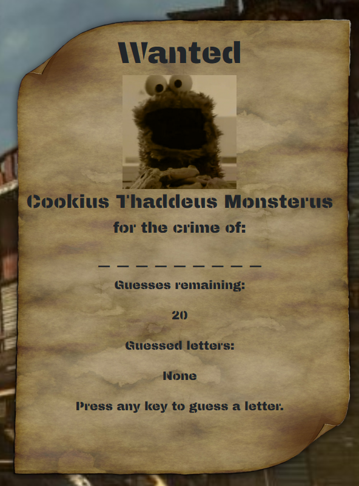

### you've arrived in town with the notorious bandit Cookius Thaddeus Monsterus on the back of your horse. Now you just need to remember what he was wanted for or the sherrif won't pay you your $50.

#### I still don't know what the rubrick means by "technologies used and screenshots of essential code" because technically all the code is essential so I'm just gonna screencap every line of code and lay out what they do here:

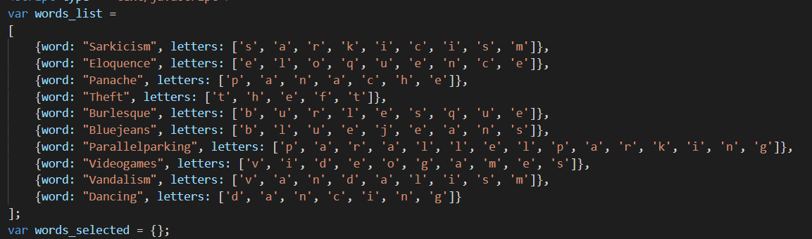

here we see the array of objects that are then pulled into the words_selected object later. (side note I never used the "name" variable but I put it in there in case I needed it. and I guess it makes it more readable.)

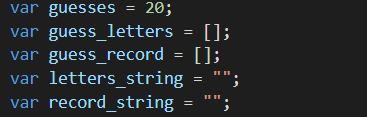

some initial variables set up here. these will be used to hold the lists of letters guessed as well as the number of letters currently shown to the screen which is then passed into their respective string variables and written to the dom

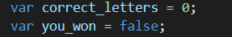

more variables for calculating the win state

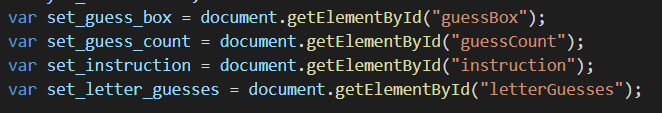

pulling the various document files I will need to edit ahead of time

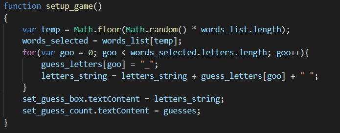

this function is called in the body as onload to run when the page is first loaded. here is where the word is selected with math.random and pulled into words_selected. the object's letter length is parsed out into its initial variables as hidden underscores and the document is updated according to the new information.

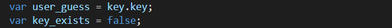

The first variables in the onkeyup function grabbing which key was pressed and setting the key check back to false.

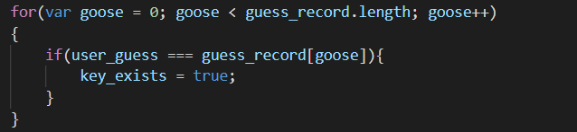

checks through the list of previous guesses and pings if the letter has been pressed before

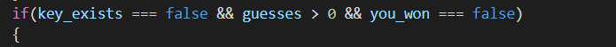

logic for the next blocks of code so the game ends if the guesses reach 0 or the win state is triggered

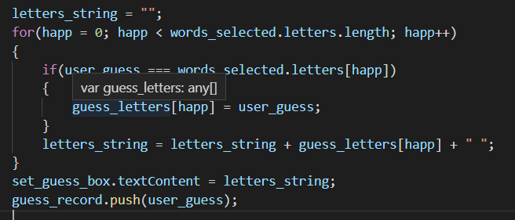

resetting the string for neatness to refactor it. accidentally leaving my mouse in the screenshot... this code takes the guessed key and runs it through the selected word's letters, passing each correct letter into its place in the hidden underscore array, which then gets rewritten to its recently cleared string, writing it to the dom, and pushing the pressed letter into the already pressed keys for future reference.

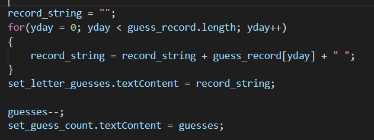

almost done now 3 more to go.

resetting the record string for neatness and refactoring it with the new set of guessed letters. subtracting from guesses and updating the dom of both of these.

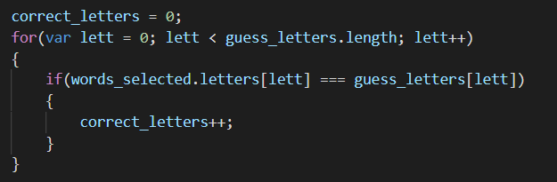

reads through the hidden variables and checks how many of them are the same as the words_selected letters and adds to the correct guess counter (after resetting for neatness of course).

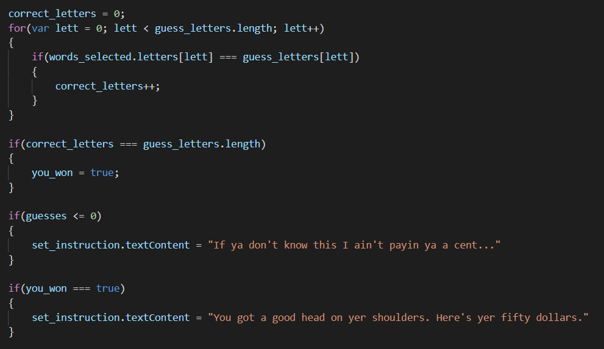

the final erroneous logic where I apparently screenshotted the correct letters loop in but am too tired to fix now. if the correct letters amount has reached the length of guess_letters (really the length of that and words_selected is the same so there's no difference) and setting the dom text to write for winning and losing.

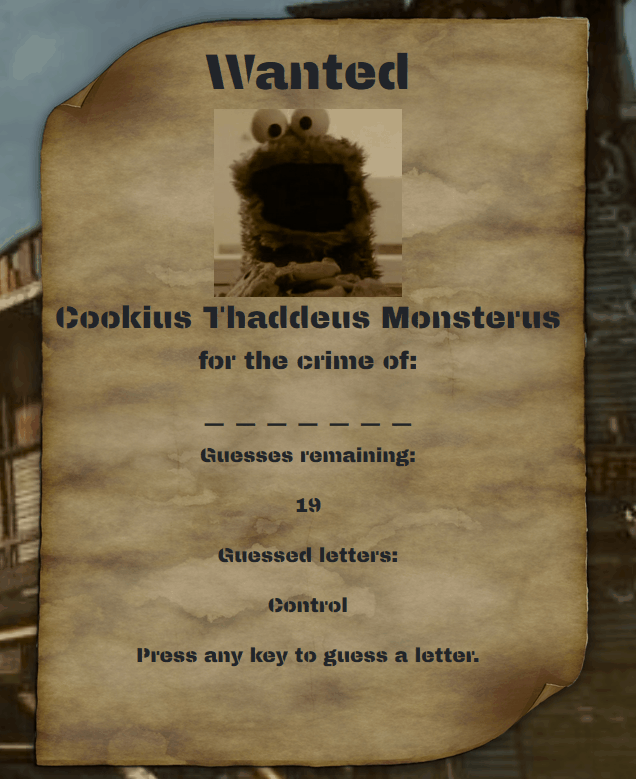

and here we go the final result. see how my beautiful and perfect code recognizes non alphabetical keys such as control as legitimate guesses.
